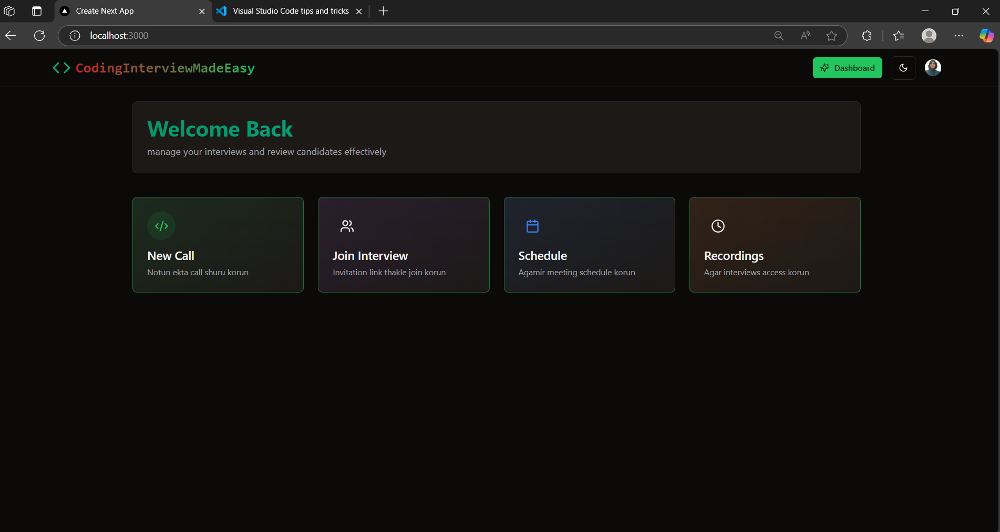
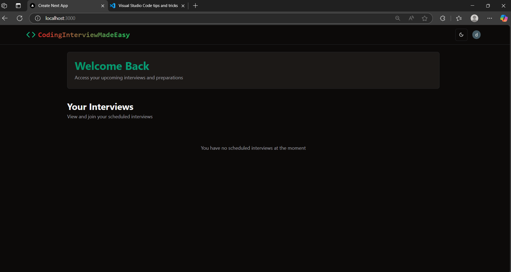
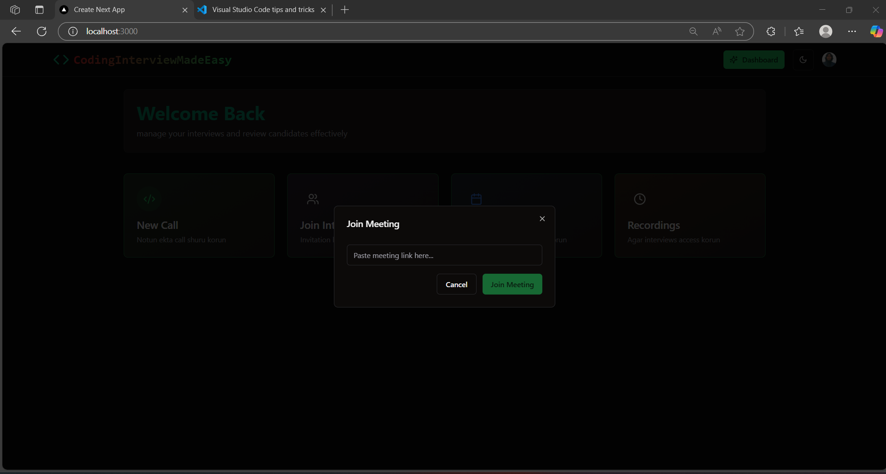
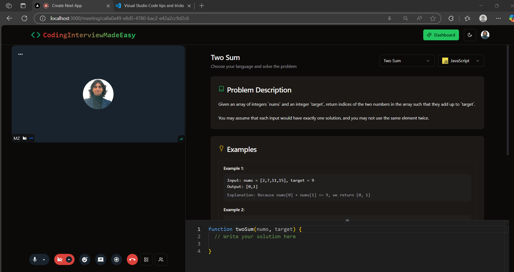
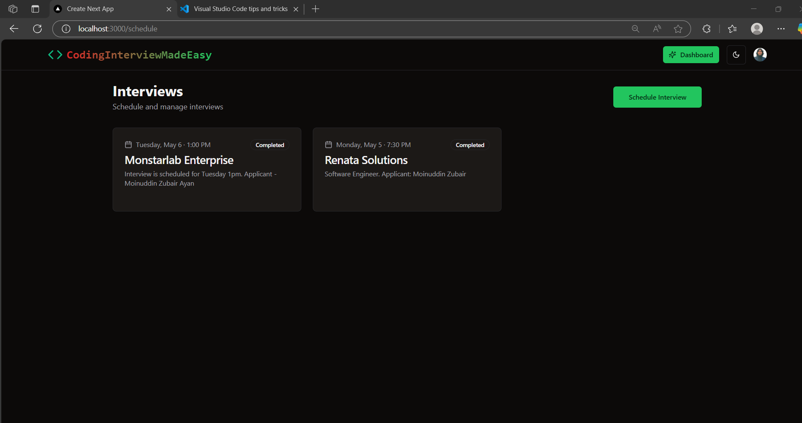
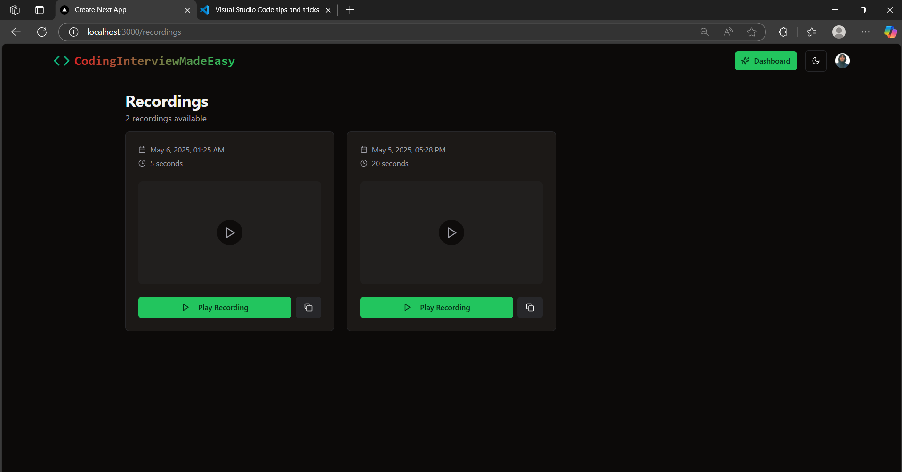
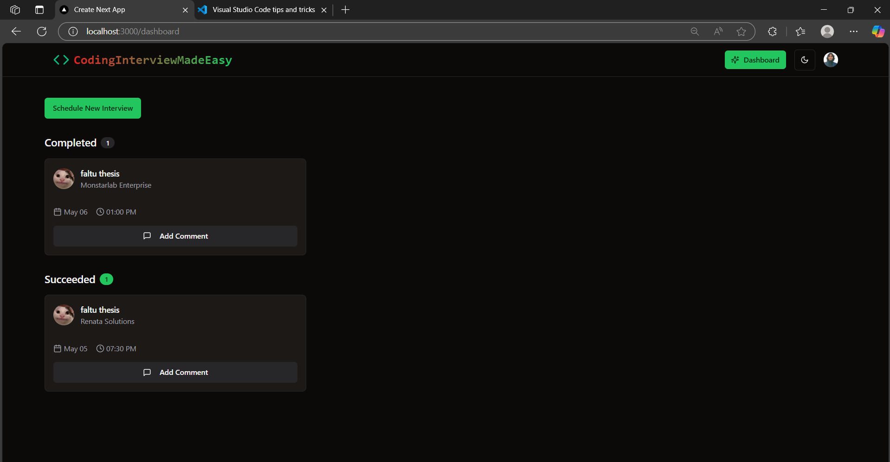

This is a coding based Interview platform designed for ease of interviews for the recruiters. Cenetred on just one platform, the interviewers of the company would be able to login into the system using individual google credentials and schedule meetings accordingly with the applicants. There is a video and audio feature included along with the code board just on the right which is a real time code board that allows the interviewer to review the code live. The questions and the programming languages can be changed as per preference. I have also integrated the screen recording option and along with it the ability to screen record videos and save it for later within. 

This is the Interviewer Viewpoint:



This is the Candidate ViewPoint:



This is the view of the Join Meeting Room:



This is the view of Video Call Room:



This is the view of the Schedule Interview Window:



This is the viewpoint of the the Recordings Page:



This is the Dashboard view (gives you the ability to assign interview as pass or fail):




This is a [Next.js](https://nextjs.org) project bootstrapped with [`create-next-app`](https://nextjs.org/docs/app/api-reference/cli/create-next-app).

## Getting Started

First, run the development server:

```bash
npm run dev
# or
yarn dev
# or
pnpm dev
# or
bun dev
```

Open [http://localhost:3000](http://localhost:3000) with your browser to see the result.

You can start editing the page by modifying `app/page.tsx`. The page auto-updates as you edit the file.

This project uses [`next/font`](https://nextjs.org/docs/app/building-your-application/optimizing/fonts) to automatically optimize and load [Geist](https://vercel.com/font), a new font family for Vercel.

## Learn More

To learn more about Next.js, take a look at the following resources:

- [Next.js Documentation](https://nextjs.org/docs) - learn about Next.js features and API.
- [Learn Next.js](https://nextjs.org/learn) - an interactive Next.js tutorial.

You can check out [the Next.js GitHub repository](https://github.com/vercel/next.js) - your feedback and contributions are welcome!

## Deploy on Vercel

The easiest way to deploy your Next.js app is to use the [Vercel Platform](https://vercel.com/new?utm_medium=default-template&filter=next.js&utm_source=create-next-app&utm_campaign=create-next-app-readme) from the creators of Next.js.

Check out our [Next.js deployment documentation](https://nextjs.org/docs/app/building-your-application/deploying) for more details.
